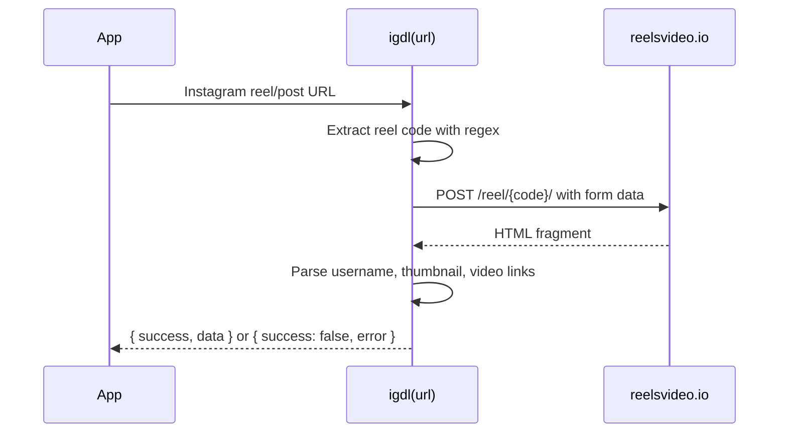

`sawit-utils` is structured as a flat utility package with one published barrel file, `src/index.js`, that re-exports focused helpers from three pure utility modules and one scraper module. The design favors direct function calls over classes or factories, which keeps the public API small and the runtime model easy to reason about.

```mermaid
graph TD
  A[package.json exports "." to src/index.js]
  A --> B[src/index.js]
  B --> C[src/format.js]
  B --> D[src/string.js]
  B --> E[src/validation.js]
  B --> F[src/scraper/igdl.js]
  B --> G[src/index.d.ts]
  G --> H[src/types/igdl.d.ts]
  C --> I[moment-timezone]
  F --> J[fetch to reelsvideo.io]
```

## Published Entry Point

The published entry point is defined in `package.json`:

- `"main": "./src/index.js"`
- `"types": "./src/index.d.ts"`
- `"exports": { ".": "./src/index.js" }`

That means consumers import from `sawit-utils`, not from individual source files. The repository also contains a root-level `index.js`, but that file is not the published entry point. The docs in this site follow the published surface defined by `package.json` and implemented in `src/index.js`.

## Module Roles

### `src/index.js`

This file is the only runtime entry point consumers need. It re-exports:

- all functions from `src/format.js`
- all functions from `src/string.js`
- all functions from `src/validation.js`
- `igdl` from `src/scraper/igdl.js`
- three small general helpers defined inline: `generateUID`, `getRandomElement`, and `delay`

The result is a single-import experience, but the modules still stay logically separated.

### `src/format.js`

This module groups presentation-oriented helpers: greetings, medal labels, timer formatting, locale-based number and date formatting, uptime formatting, and duration formatting. It is mostly pure, with one external dependency: `moment-timezone` for `convertMsToDuration(ms)`. The rest of the functions rely on built-in `Date`, `Intl`, and arithmetic.

### `src/string.js`

This module contains text-oriented helpers:

- `levenshtein()` implements dynamic-programming edit distance with an optional early-exit threshold.
- `findTopSuggestions()` builds on that distance function to rank candidate commands.
- `escapeHTML()` performs literal character replacement for common HTML metacharacters.

The important architectural point is that `findTopSuggestions()` depends on `levenshtein()`, so the string utilities are not just independent helpers; one function composes another within the same module.

### `src/validation.js`

This module keeps checks intentionally lightweight:

- MIME helpers use `startsWith()` and `endsWith()`.
- `isEmptyObject()` uses a `for...in` loop to detect enumerable keys.
- `isURL()` combines `URL.canParse()` with a regex fallback.
- `isWhatsAppURL()` uses a permissive regex and a domain substring check.

The implementation is fast and dependency-free, but some checks are intentionally broad rather than strict validators. That trade-off matters in user-facing input pipelines.

### `src/scraper/igdl.js`

This is the only networked module. Its flow is:



The scraper normalizes results into a discriminated union defined by `src/types/igdl.d.ts`. It does not expose the upstream HTML or response object, which keeps the consumer API stable even if the scraper internals change.

## Key Design Decisions

### One barrel export instead of per-module entry points

The barrel export in `src/index.js` makes usage terse:

```ts
import { formatSize, isURL, igdl } from "sawit-utils";
```

That is convenient for bot scripts and utility-heavy codebases, which appears to match the README statement that the package started as a utility library for a WhatsApp bot project. The trade-off is that every public function shares the same import path, so documentation has to provide conceptual grouping instead of relying on separate import locations.

### Functions over classes

There are no constructors, instances, or retained state objects anywhere in `src/`. Most functions are pure or close to pure, which reduces mental overhead and makes ad hoc scripting easy. The only functions that depend on ambient state are `formatUptime()` and `delay()`, which use `Date.now()` and `setTimeout()`, and `igdl()`, which depends on network access and a third-party HTML shape.

### Type declarations live beside the source tree

The runtime is plain JavaScript, while TypeScript support is provided by `src/index.d.ts` and `src/types/igdl.d.ts`. That separation keeps build tooling simple, but it also means type drift is possible if the implementation changes without the declarations being updated. For consumers, the important point is that the types are explicit and readable.

### Scraper output is normalized

`igdl()` converts a noisy HTML response into a stable object with:

- `username`
- `thumbnail`
- `videos`
- `videoUrl`
- `alternativeUrl`

That is a practical design choice for application code, because most callers want a usable URL immediately rather than a raw HTML parser result.

## How the Pieces Fit Together

From an application perspective, the package divides cleanly into two layers:

1. Pure utilities for formatting, validation, string processing, IDs, timing, and selection.
2. One adapter-style scraper that reaches out to a third-party site and returns normalized metadata.

The request or data lifecycle usually looks like this:

- Validate inbound text or URLs with the helpers in `src/validation.js`.
- Sanitize or rank user input with `src/string.js`.
- Format outbound values for display using `src/format.js`.
- If the input is an Instagram URL, hand it to `igdl()` and branch on `result.success`.

That flow is reflected in the guides and API reference pages linked from this section: [Formatting Utilities](/docs/formatting-utilities), [Validation Helpers](/docs/validation-helpers), and [IGDL API](/docs/api-reference/igdl).
