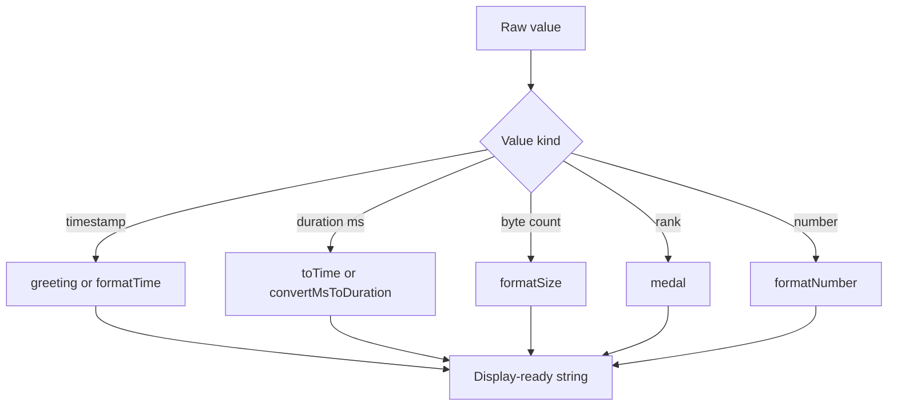

Formatting is the largest concept in `sawit-utils`. The module `src/format.js` contains eight exported functions that convert raw values into labels your users can read: greetings, medals, clock strings, localized numbers, human-readable byte sizes, localized timestamps, uptime strings, and long-form durations.

This concept exists because messaging bots, dashboards, and automation scripts repeatedly need presentation helpers, but they rarely justify a full formatting framework. The library keeps those jobs small and direct.

## How It Relates to the Rest of the Library

Formatting usually sits at the end of a workflow:

- validation decides whether input is safe to use
- string helpers shape or sanitize text
- formatting prepares the final output message

The core module for this concept is `src/format.js`, while `src/index.js` exposes the same functions from the package root.



## How It Works Internally

The implementation uses three different strategies:

- Arithmetic formatting in `toTime(ms)` and `formatUptime(startTime)`.
- Built-in locale formatting in `formatNumber(number)` and `formatTime(timestampMs, locale, options)`.
- `moment.duration(ms)` in `convertMsToDuration(ms)`.

Some specifics from `src/format.js` matter when you rely on these helpers:

- `greeting(now)` reads the hour with `new Date(now).getHours()` and maps hour ranges to four greetings.
- `formatSize(byteCount, withPerSecond)` starts from `"Bytes"` at index `8` in a custom units array and scales down or up by powers of 1024.
- `formatTime()` defaults to `en-US` and a 24-hour format unless you override the `Intl.DateTimeFormatOptions`.
- `convertMsToDuration()` returns `"0 seconds"` for non-positive input, then builds a string by checking years down to seconds.

## Basic Usage

Use the module when you need display text and do not want to repeat formatting rules across handlers.

```ts
import {
  greeting,
  medal,
  toTime,
  formatNumber,
} from "sawit-utils";

const startedAt = new Date("2023-01-01T08:00:00Z").getTime();

console.log(greeting(startedAt));
console.log(medal(1));
console.log(toTime(9050));
console.log(formatNumber(1500000));
```

## Advanced Usage

The more realistic pattern is to combine several helpers into one response payload.

```ts
import {
  formatSize,
  formatTime,
  formatUptime,
  convertMsToDuration,
} from "sawit-utils";

const bootTime = Date.now() - 172_801_234;
const backupSize = 2_684_354_560;
const nextRun = Date.now() + 5 * 60 * 1000;

const summary = [
  `Uptime: ${formatUptime(bootTime)}`,
  `Backup size: ${formatSize(backupSize)}`,
  `Next run: ${formatTime(nextRun, "en-GB", { timeZone: "UTC" })}`,
  `Retry delay: ${convertMsToDuration(90_500)}`,
].join("
");

console.log(summary);
```

<Callout type="warn">`formatSize(0)` returns the literal string `0 yBytes` because the zero case is hard-coded that way in `src/format.js`. If you need `0 Bytes`, normalize the output in your application layer. Also note that `greeting()` uses the runtime's local timezone unless you pass a timestamp that already represents the timezone you want.</Callout>

## Trade-offs

<Accordions>
<Accordion title="Why use these helpers instead of raw Intl APIs everywhere?">
The main advantage is consistency. If your project sends status messages from several modules, using one shared helper keeps byte sizes, timestamps, and timer displays uniform without repeating formatting code in every handler. The downside is that the helpers encode fixed choices, such as the default `en-US` locale in `formatTime()` and the custom units list in `formatSize()`. If your application needs strict i18n behavior for every output path, you may prefer wrapping these utilities inside a project-specific presentation layer.

```ts
import { formatTime } from "sawit-utils";

const label = formatTime(Date.now(), "id-ID", { timeZone: "Asia/Jakarta" });
```

</Accordion>
<Accordion title="Why does convertMsToDuration rely on moment-timezone?">
`convertMsToDuration()` uses `moment.duration(ms)` from `moment-timezone`, which simplifies breaking milliseconds into years, months, weeks, days, hours, minutes, and seconds. That makes the implementation short and readable, but it also means the formatting module has an external dependency instead of staying fully standard-library based. For small scripts, that trade-off is acceptable because the dependency is already declared in `package.json`. For highly size-sensitive runtimes, a custom duration formatter would be leaner.

```ts
import { convertMsToDuration } from "sawit-utils";

console.log(convertMsToDuration(3_661_000));
```

</Accordion>
</Accordions>

## Common Patterns

- Use `toTime(ms)` for compact timer-style strings such as `01:01:01`.
- Use `convertMsToDuration(ms)` for prose-like output such as `1 hours 1 minutes 1 seconds`.
- Use `formatTime()` when you need locale and timezone control.
- Use `formatUptime(startTime)` when you store a process boot timestamp and want a live status label.

The exact signatures and parameter defaults are documented in [Format API Reference](/docs/api-reference/format).
