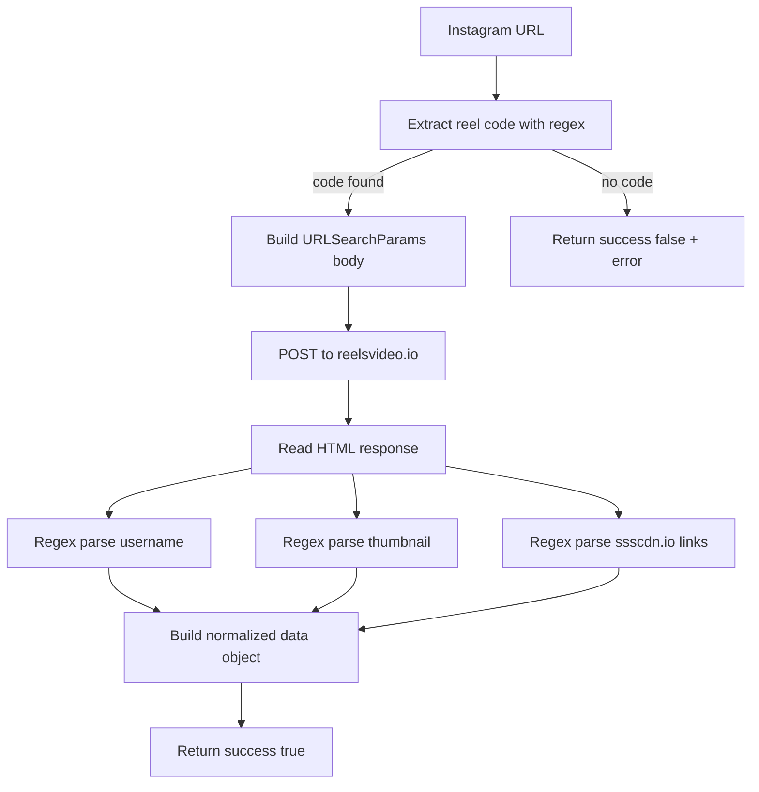

The `igdl(url)` function in `src/scraper/igdl.js` is the most specialized concept in `sawit-utils`. It takes an Instagram reel, post, or TV URL, calls a third-party site, parses returned HTML, and normalizes the result into a small union type defined in `src/types/igdl.d.ts`.

This concept exists because the rest of the package is about lightweight application helpers, and media download workflows often need a similarly lightweight adapter instead of a full Instagram integration stack.

## How It Relates to Other Concepts

`igdl()` works best when combined with validation and formatting:

- use `isURL()` before calling it
- use `formatTime()` or `formatSize()` when presenting follow-up metadata in your app
- use `delay()` if your workflow needs backoff around repeated download jobs

The public runtime function is exported from `src/index.js`, while the result types are exported from `src/index.d.ts`.



## How It Works Internally

The function has four stages:

1. Extract the reel code from one of three supported URL forms:
   - `instagram.com/reel/...`
   - `instagram.com/p/...`
   - `instagram.com/tv/...`
2. Build a `URLSearchParams` body with `id`, `locale`, and two fixed fields, `tt` and `ts`.
3. Send a `POST` request to `https://reelsvideo.io/reel/{reelCode}/` with browser-like headers.
4. Parse the returned HTML with regular expressions to extract:
   - `username`
   - `thumbnail`
   - one or more `https://ssscdn.io/reelsvideo/...` video URLs

The function deduplicates video links with `new Set()`, labels each one as `"HD"`, and returns the first two as `videoUrl` and `alternativeUrl`.

## Basic Usage

Branch on `success` immediately. The result is designed for that discriminated-union style.

```ts
import { igdl } from "sawit-utils";

const result = await igdl("https://www.instagram.com/reel/C8abc123xyz/");

if (!result.success) {
  console.error(result.error);
} else {
  console.log(result.data.username);
  console.log(result.data.videoUrl);
}
```

## Advanced Usage

A more defensive integration validates the URL first and then normalizes the downloader output for your own service layer.

```ts
import { igdl, isURL } from "sawit-utils";

export async function resolveInstagramDownload(input: string) {
  if (!isURL(input)) {
    return { ok: false, reason: "Input is not a valid URL" };
  }

  const result = await igdl(input);
  if (!result.success) {
    return { ok: false, reason: result.error };
  }

  return {
    ok: true,
    username: result.data.username ?? "unknown",
    primaryUrl: result.data.videoUrl,
    fallbackUrls: result.data.videos.map((video) => video.url),
    thumbnail: result.data.thumbnail,
  };
}
```

<Callout type="warn">`igdl()` depends on the HTML structure and request contract of `reelsvideo.io`. The source code in `src/scraper/igdl.js` includes fixed `tt` and `ts` form fields and regex-based parsing, so upstream markup or anti-bot changes can break the function without any package API change. Treat this helper as a best-effort scraper, not a stable platform integration.</Callout>

## Trade-offs

<Accordions>
<Accordion title="Why normalize the scraper result instead of returning raw HTML?">
Returning a normalized object keeps most consumers simple. In a bot or API handler, you usually want the first usable video URL and maybe a thumbnail, not a parser tree or the raw upstream document. The trade-off is that the function throws away information that might be useful for debugging or for richer media workflows. If you need more than the exposed fields, you will have to fork the implementation in `src/scraper/igdl.js`.

```ts
import { igdl } from "sawit-utils";

const result = await igdl(url);
if (result.success) console.log(result.data.videos);
```

</Accordion>
<Accordion title="Why use regex parsing instead of a DOM parser?">
Regex parsing keeps the implementation dependency-free and short, which fits the overall style of the package. It is adequate when the upstream HTML structure is stable enough and the extracted fields are simple. The downside is fragility: a class name change or link shape change can invalidate the regex without any compile-time signal. A DOM parser would be more resilient and readable for complex extraction logic, but it would also add weight and environment constraints.

```ts
import { igdl } from "sawit-utils";

const result = await igdl("https://www.instagram.com/p/C8abc123xyz/");
console.log(result.success);
```

</Accordion>
</Accordions>

## Operational Guidance

- Validate the input URL before calling `igdl()`.
- Log `result.error` so scraper breakage is visible in production.
- Prefer server-side usage where `fetch` is available and CORS is not a browser concern.
- Keep a fallback path in your app when the upstream scraper site changes behavior.

For exact runtime and type details, see [IGDL API Reference](/docs/api-reference/igdl) and [Types](/docs/types).
