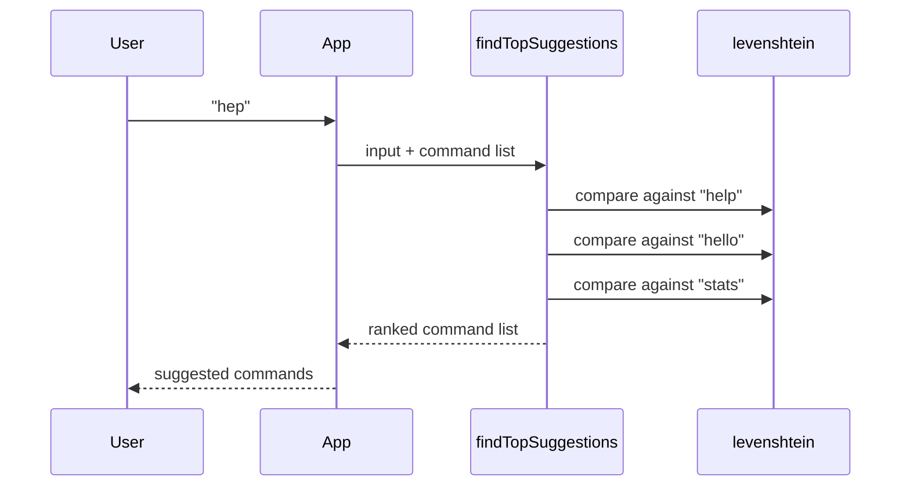

The string utilities in `src/string.js` solve two common problems in small JavaScript apps: ranking text by similarity and escaping unsafe HTML characters before display. They are intentionally simple, but the module still has real internal structure because `findTopSuggestions()` builds directly on `levenshtein()`.

This concept matters most in command handlers, chatbots, search-like pickers, and any UI that needs to echo user input safely.

## How It Relates to Other Concepts

String utilities usually sit between validation and formatting:

- validation checks whether the input should be accepted
- string utilities interpret or sanitize the text
- formatting shapes the output message

They also pair naturally with the general utilities in `src/index.js`, such as `delay()` for retry loops or `generateUID()` for caching suggestion sessions.



## How It Works Internally

### `levenshtein(value, other, maxDistance = Infinity)`

This function implements the classic dynamic-programming edit distance algorithm. It allocates two arrays, `v0` and `v1`, to represent the previous and current row of the distance matrix. For each character pair, it computes insertion, deletion, and substitution costs, then keeps the minimum.

One implementation detail is particularly useful: each row tracks `rowMin`, and if that minimum exceeds `maxDistance`, the function returns `maxDistance + 1` early. That keeps worst-case work down when you only care about near matches.

### `findTopSuggestions(input, commands = [], limit = 3)`

This function lowercases and trims the input, maps each command to a `{ command, distance }` object, sorts by ascending distance, slices the top `limit`, and returns only the command strings. It always calls `levenshtein(query, command, 3)`, so the suggestion ranking currently uses a fixed maximum distance threshold of `3`.

### `escapeHTML(text)`

This function converts `&`, `<`, `>`, `"`, and `'` into HTML entities with chained `.replace()` calls. It does not parse HTML, strip tags, or sanitize URLs; it only escapes literal text content.

## Basic Usage

The suggestion flow is useful when a command is misspelled but still close to a supported action.

```ts
import { findTopSuggestions } from "sawit-utils";

const commands = ["help", "hello", "stats", "download"];
const suggestions = findTopSuggestions("hep", commands);

console.log(suggestions);
```

## Advanced Usage

A practical pattern is to combine fuzzy matching with HTML escaping before rendering user-controlled content.

```ts
import {
  levenshtein,
  findTopSuggestions,
  escapeHTML,
} from "sawit-utils";

const input = "<b>helo</b>";
const safeInput = escapeHTML(input);
const commands = ["help", "hello", "healthcheck"];

const nearest = findTopSuggestions("helo", commands, 2);
const isVeryClose = levenshtein("helo", "hello", 2) <= 2;

console.log({ safeInput, nearest, isVeryClose });
```

<Callout type="warn">`findTopSuggestions()` sorts and returns the top matches even when every candidate is still a poor match. If you need a hard confidence threshold, run `levenshtein()` yourself and filter out results whose distance is greater than your tolerance. Also note that `escapeHTML()` only escapes text; it is not a full HTML sanitizer for rich content.</Callout>

## Trade-offs

<Accordions>
<Accordion title="Why use Levenshtein distance instead of semantic search?">
The implementation in `src/string.js` is tiny, dependency-free, and predictable. That makes it a good fit for command names, short labels, and typo correction where edit distance is usually enough. The trade-off is that it does not understand synonyms, word order, or intent, so `"download reel"` and `"save instagram"` are not treated as related unless their character edits happen to be close. For larger search problems, semantic indexing or token-based ranking would outperform this approach.

```ts
import { levenshtein } from "sawit-utils";

console.log(levenshtein("helo", "hello"));
```

</Accordion>
<Accordion title="Why escape text instead of sanitizing HTML trees?">
Escaping is the safest default when your application wants to display user input as plain text. The implementation is transparent and cheap, and it avoids the complexity of parsing HTML. The limitation is that it cannot preserve allowed tags or selectively sanitize attributes, so it is unsuitable if your application intentionally accepts rich HTML input. In that case, you would use a dedicated sanitizer upstream and reserve `escapeHTML()` for plain-text rendering paths.

```ts
import { escapeHTML } from "sawit-utils";

console.log(escapeHTML(``));
```

</Accordion>
</Accordions>

## Where to Go Next

- Use [Validation Helpers](/docs/validation-helpers) before ranking or rendering external input.
- Use [General API Reference](/docs/api-reference/general) if you want to combine suggestions with `delay()` or `generateUID()`.
- See [String API Reference](/docs/api-reference/string) for full signatures and examples.
