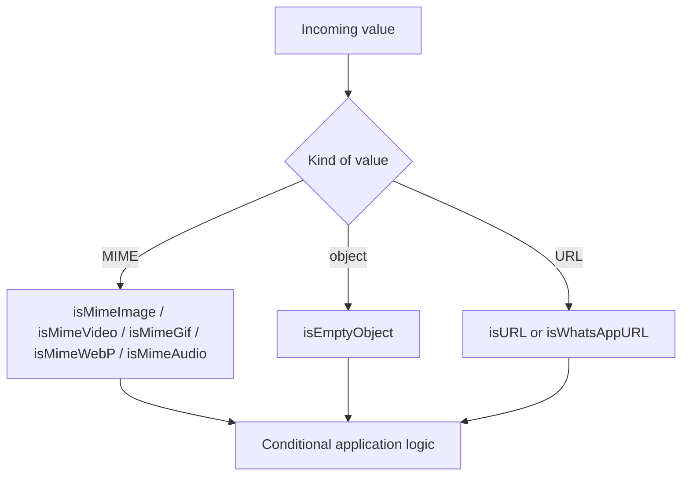

The validation helpers in `src/validation.js` are small guard functions for categorizing MIME strings, checking objects, and validating URLs. They exist to keep repetitive conditional logic out of command handlers and scraping entry points.

These helpers are intentionally lightweight. They are best used as fast pre-checks, not as full security or compliance validators.

## How It Relates to Other Concepts

Validation sits at the front of most workflows in this library:

- it filters external inputs before `igdl()` performs network work
- it gates user input before string utilities rank or escape text
- it protects formatting functions from obviously invalid values

The module is fully dependency-free and is re-exported by `src/index.js`.



## How It Works Internally

The MIME helpers are simple string prefix or suffix checks:

- `isMimeImage(mime)` checks `mime.startsWith("image")`
- `isMimeVideo(mime)` checks `mime.startsWith("video")`
- `isMimeGif(mime)` checks `mime.endsWith("gif")`
- `isMimeWebP(mime)` checks `mime.endsWith("webp")`
- `isMimeAudio(mime)` checks `mime.startsWith("audio")`

`isEmptyObject(object)` uses a `for...in` loop and returns `false` as soon as any enumerable key is seen. That makes it fast, but it also means inherited enumerable properties count as non-empty.

`isURL(string)` first rejects non-strings, then returns `URL.canParse(string) || urlRegex.test(string)`. The regex only accepts `http` or `https`, and `URL.canParse` widens support in runtimes that implement it.

`isWhatsAppURL(string)` is intentionally permissive. It uses a regex for `chat.whatsapp.com`, `whatsapp.com/channel`, and `wa.me` patterns, but it also returns `true` whenever `string.includes("whatsapp.com")`.

## Basic Usage

Use the helpers as early guards before you do more expensive work.

```ts
import {
  isMimeImage,
  isMimeVideo,
  isURL,
} from "sawit-utils";

console.log(isMimeImage("image/png"));
console.log(isMimeVideo("video/mp4"));
console.log(isURL("https://example.com"));
```

## Advanced Usage

This example validates a webhook payload before deciding whether to continue processing it.

```ts
import {
  isEmptyObject,
  isMimeAudio,
  isURL,
  isWhatsAppURL,
} from "sawit-utils";

function validateAttachment(payload: {
  metadata: Record<string, unknown>;
  mime: string;
  sourceUrl: string;
}) {
  if (isEmptyObject(payload.metadata)) {
    throw new Error("Missing metadata");
  }

  if (!isMimeAudio(payload.mime)) {
    throw new Error("Only audio attachments are allowed");
  }

  if (!isURL(payload.sourceUrl)) {
    throw new Error("Attachment URL is invalid");
  }

  return {
    ok: true,
    fromWhatsApp: isWhatsAppURL(payload.sourceUrl),
  };
}
```

<Callout type="warn">These helpers are broad checks, not strict validators. `isWhatsAppURL()` returns `true` for any string containing `whatsapp.com`, and `isEmptyObject()` treats inherited enumerable keys as content. If the result controls authorization, billing, or storage policy, follow these helpers with stricter parsing rules in your own code.</Callout>

## Trade-offs

<Accordions>
<Accordion title="Why are the MIME checks so permissive?">
The MIME helpers are optimized for speed and readability, not for exhaustive standards compliance. A prefix test like `startsWith("image")` is enough for many upload gates and bot commands where the upstream platform already provides normalized MIME types. The trade-off is that malformed or oddly cased strings may slip through unless you normalize them first. If your application depends on exact subtype allowlists, add an explicit set membership check after the helper.

```ts
import { isMimeImage } from "sawit-utils";

const allowed = new Set(["image/png", "image/jpeg"]);
const accepted = isMimeImage("image/png") && allowed.has("image/png");
```

</Accordion>
<Accordion title="Why combine URL.canParse with a regex?">
Using `URL.canParse()` gives the function a standards-based fast path in modern runtimes, while the regex preserves useful behavior where the platform API might be limited or where plain `http` and `https` detection is all you need. The trade-off is that the exact acceptance behavior may vary a little by runtime because `URL.canParse()` is provided by the environment. If cross-runtime consistency is critical, treat `isURL()` as a pre-check and then re-parse the accepted value with your own canonical URL handling.

```ts
import { isURL } from "sawit-utils";

if (isURL(candidate)) {
  const parsed = new URL(candidate);
  console.log(parsed.hostname);
}
```

</Accordion>
</Accordions>

The exact parameter and return types are documented in [Validation API Reference](/docs/api-reference/validation).
